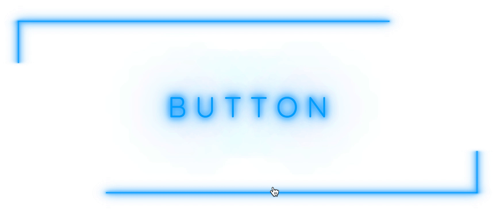

# Glowing Button

In this project I created a glowing button with animated borders, using only CSS animations. I animated attributes, which are cost effective performance-wise. My understanding of CSS animations bases on the article [Smooth as Butter: Achieving 60 FPS Animations with CSS3](https://medium.com/outsystems-experts/how-to-achieve-60-fps-animations-with-css3-db7b98610108). I made it to be dynamic, that you can customize button visuals, set the animation speed and it generates the CSS from the SCSS.

Link to live version - [Glowing button](https://no-time-to-die.herokuapp.com/)

## Screenshot

## Getting Started

Clone the repository into your local computer.

### Prerequisites

So you'll need some code editor which will be able to preprocess SASS, I use VS Code (link in the "Built With" section). Then you can customize your button outlook to the desired result, set the animation related variables and it generates the necessary CSS for you. Result is visible in any browser, e.g. Chrome, Firefox etc. Then you can implement the code in your own project.

### Usage

Open project in your code editor, customize the `style.scss` file for your own needs, add the button text in the `index.html` after the first six empty spans. Every letter has to be in its separate span block. Open `index.html` file in your browser.

## Built With

* [HTML](https://en.wikipedia.org/wiki/HTML) - Hypertext Markup Language
* [SCSS](https://sass-lang.com/) - CSS with superpowers
* [CSS](https://www.w3.org/Style/CSS/Overview.en.html) - Cascading Style Sheets
* [VS Code](https://code.visualstudio.com/) - The code editor used 

## Authors

👤 **Jaak Kivinukk**

- Github: [@Jaakal](https://github.com/Jaakal)
- Twitter: [@JKivinukk](https://twitter.com/JKivinukk)
- Linkedin: [Jaak Kivinukk](https://www.linkedin.com/in/jaak-kivinukk)
- Email: [jaak.kivinukk@gmail.com](jaak.kivinukk@gmail.com)

## License

This project is licensed under the MIT License - see the [LICENSE](LICENSE) file for details

## Acknowledgments
* [Smooth as Butter: Achieving 60 FPS Animations with CSS3](https://medium.com/outsystems-experts/how-to-achieve-60-fps-animations-with-css3-db7b98610108) - In my opinion one of the best article there is about CSS animations
